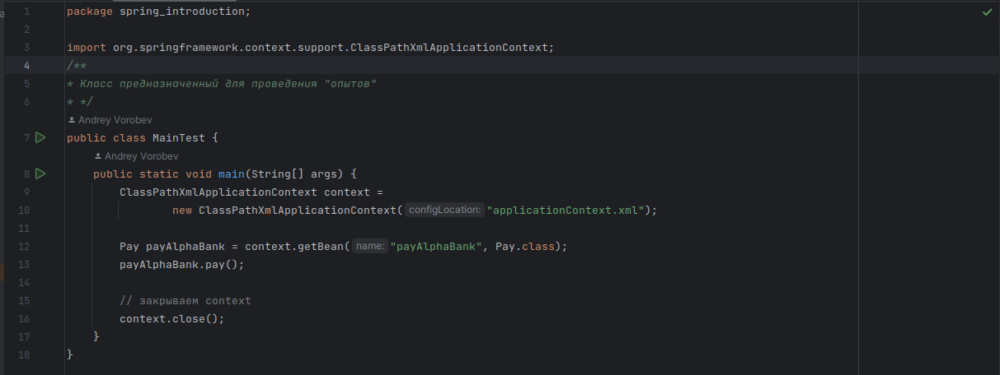

# Spring - основной фреймворк для Java # 

Spring предлагает *контейнер*, часто называемым **контекстом приложения
Spring**, который создаёт компоненты приложения и управляет ими. Эти компоненты, или *bean-компоненты*,
объединяются внутри контекста Spring.

Помимо основного контейнера, Spring и сопутствующие библиотеки предлагают веб-фреймворк, различные механизмы хранения данных, фреймворк безопасности, интеграцию с другими системами, мониторинг
времени выполнения, поддержку микросервисов, модель реактивного программирования и многое другое для разработки современных приложений.

Акт объединения *bean-компонентов* основан на шаблоне, известном как **внедрение зависимостей (Dependency Injection, DI)**.

В технологии внедрения зависимостей компоненты не создаются и не поддерживают жизненный цикл других компонентов, от которых
они зависят, а полагаются на отдельный объект (**контейнер**), который создаёт все нужные компоненты и внедряет их в другие компоненты.

### Основные функции Spring Container:
- IoC - инверсия управления. Создание и управление объектами. То есть передача программистом прав на создание и управление Spring-у;
- DI - внедрение зависимостей. 

## Способы конфигурации Spring Container:


### XML file
Spring container-у необходимо описать, в конфигурационном файле, сколько и каких объектов создать. Только после этого мы можем сказать, что жизненным циклом управляет Spring.
Это конфигурационный файл будем создавать в папке "*resources*", по сложившейся традиции принято называть "**applicationContext.xml**"
Пример:
```html
<?xml version="1.0" encoding="UTF-8"?>
<beans xmlns="http://www.springframework.org/schema/beans"
       xmlns:xsi="http://www.w3.org/2001/XMLSchema-instance"
       xmlns:context="http://www.springframework.org/schema/context"
       xsi:schemaLocation="http://www.springframework.org/schema/beans
       http://www.springframework.org/schema/beans/spring-beans.xsd
       http://www.springframework.org/schema/context
       http://www.springframework.org/schema/context/spring-context.xsd">
</beans>
```
Не будем подробно разбирать данный текст, тут всего лишь описывается, что мы можем использовать Spring Framework.

Разберём на примере оплаты заказов различными способами. Создаём bean для класса AlphaBank, для этого в "*xml file*" прописываем следующие:
```html
    <bean id = "payAlphaBank"
          class="spring_introduction.AlphaBank">
    </bean>
```
`id` - имя по которому мы будем обращаться к Spring-у для создания объекта;

`class` - полное имя класса.

Теперь переходим в класс `MainTest` и указываем, что дальше мы хотим использовать applicationContext следующим способом:
```java
ClassPathXmlApplicationContext context =
        new ClassPathXmlApplicationContext("applicationContext.xml");
```
В качестве аргумента передаём название xml file, если вы выбрали другое название.

Остаётся создать bean `payAlphaBank`, вызвать наш метод `pay()` и закрыть `context`

```java
Pay payAlphaBank = context.getBean("payAlphaBank", Pay.class);
payAlphaBank.pay();

// закрываем context
context.close();
```


